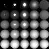
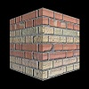
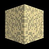

# webgl-pbr-test
Testing PBR with WebGL

|Library                                                      |License                                                                      |                                                     |                                                          |                                                           |
|:------------------------------------------------------------|:----------------------------------------------------------------------------|:------------------------------------------------------------------------------------:|:---------------------------------------------------------------------------------------------:|:-----------------------------------------------------------------------------------------------:|
|[three.js](https://github.com/mrdoob/three.js/)              |[MIT](https://github.com/mrdoob/three.js/blob/master/LICENSE)                |[Link](https://cx20.github.io/webgl-pbr-test/examples/threejs/simple/index.html)      |[Link](https://cx20.github.io/webgl-pbr-test/examples/threejs/brick-wall/index.html) (WIP)     |[Link](https://cx20.github.io/webgl-pbr-test/examples/threejs/metal-tiles/index.html) (WIP)      |
|[Babylon.js](https://github.com/BabylonJS/Babylon.js)        |[Apache v2](https://github.com/BabylonJS/Babylon.js/blob/master/license.md)  |[Link](https://cx20.github.io/webgl-pbr-test/examples/babylonjs/simple/index.html)    |[Link](https://cx20.github.io/webgl-pbr-test/examples/babylonjs/brick-wall/index.html) (WIP)   |[Link](https://cx20.github.io/webgl-pbr-test/examples/babylonjs/metal-tiles/index.html)  (WIP)   |
|[GLBoost](https://github.com/emadurandal/GLBoost)            |[MIT](https://github.com/emadurandal/GLBoost/blob/master/LICENSE)            |[Link](https://cx20.github.io/webgl-pbr-test/examples/glboost/simple/index.html)      |[Link](https://cx20.github.io/webgl-pbr-test/examples/glboost/brick-wall/index.html)           |[Link](https://cx20.github.io/webgl-pbr-test/examples/glboost/metal-tiles/index.html)            |
|[Rhodonite](https://github.com/actnwit/RhodoniteTS)          |[MIT](https://github.com/actnwit/RhodoniteTS/blob/master/LICENSE)            |[Link](https://cx20.github.io/webgl-pbr-test/examples/rhodonite/simple/index.html)    |                                                                                               |                                                                                                 |
